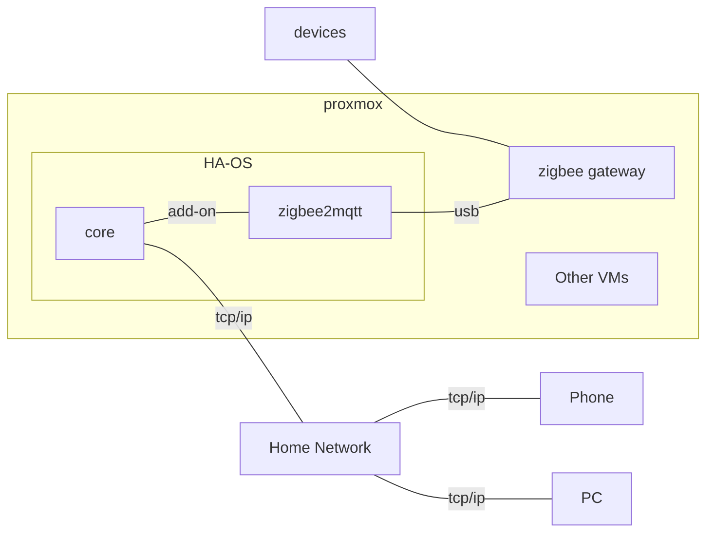

# Smart Home Architecture

## System Layout

## [Proxmox VE](https://www.proxmox.com/en/proxmox-virtual-environment/overview)

> Proxmox VE is a complete, open-source server management platform for enterprise virtualization. It tightly integrates the KVM hypervisor and Linux Containers (LXC), software-defined storage and networking functionality, on a single platform. With the integrated web-based user interface you can manage VMs and containers, high availability for clusters, or the integrated disaster recovery tools with ease.

## [Home Assistant](https://www.home-assistant.io/)

## [Zigbee](https://en.wikipedia.org/wiki/Zigbee)

> Zigbee is a low-power wireless mesh network standard targeted at battery-powered devices in wireless control and monitoring applications.

### [Zigbee2MQTT](https://www.zigbee2mqtt.io/)

> Zigbee to MQTT bridge, get rid of your proprietary Zigbee bridges

- [HA Addon](https://github.com/zigbee2mqtt/hassio-zigbee2mqtt)
- [HA Integration](https://www.home-assistant.io/integrations/mqtt/)
    - [MQTT - The Standard for IoT Messaging](https://mqtt.org/)

### [Phoscon](https://phoscon.de/en/conbee2/software) / [deCONZ](https://www.dresden-elektronik.com/wireless/software/deconz.html)

#### [deCONZ HA Integration](https://www.home-assistant.io/integrations/deconz/)

## [AppDaemon](https://github.com/AppDaemon/appdaemon)

### [AppDaemon Documentation](https://appdaemon.readthedocs.io/en/latest/)

> AppDaemon is a loosely coupled, multi-threaded, sandboxed python execution environment for writing automation apps for home automation projects, and any environment that requires a robust event driven architecture.